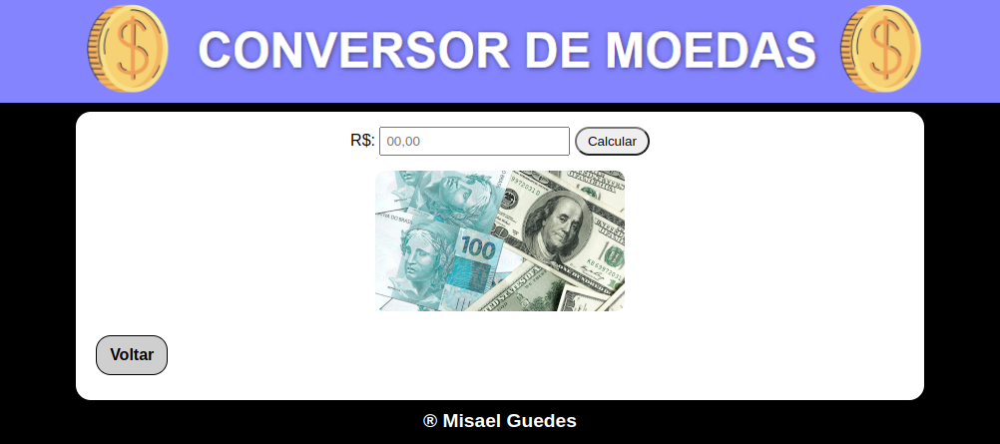

    

## 🖥️ Projeto
Este é um conversor de moedas que permite converter valores entre as seguintes moedas: Real (BRL), Dólar (USD), Euro (EUR) e Libra (GBP). Ele utiliza dados fornecidos pela API do site [AwesomeAPI](https://economia.awesomeapi.com.br/last/USD-BRL,EUR-BRL,GBP-BRL) para obter as taxas de câmbio mais recentes.

## Funcionalidades
- Conversão entre Real, Dólar, Euro e Libra.
- Atualização automática das taxas de câmbio.
- Interface simples e intuitiva.

## 🚀 Tecnologias Utilizadas
Este site foi desenvolvido utilizando as seguintes tecnologias:

- HTML
- CSS
- JavaScript

Esperamos que este conversor de moedas seja útil para você. Se tiver alguma dúvida ou precisar de assistência adicional, não hesite em entrar em contato conosco. Aproveite a sua experiência de conversão de moedas!